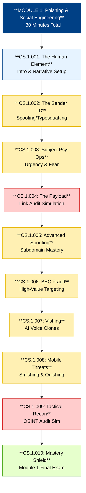

# Module 1 Review: Phishing & Social Engineering
**Target Time:** ~30 Minutes | **Persona:** Rogue AI (The Glitch)

This module dismantles the tactical and psychological layers of social engineering, from the initial "Signal" to the final "Payload."

## 🚀 The Block Stack (Instructional Path)

## 📖 Review Source Files
You can review the full scripts, visual prompts, and interactive logic for each lesson below:

1.  [CS.1.001: Human Element](file:///C:/Users/Darry/OneDrive/Brain%20Candy%20portal%20OMBU/ROOT_BODY_X/Organs_apps/VSCodeWorkingDocs/LMS%20-%20CYBER_SEC/proposal_content_0107_v2/module_1/lesson_001/CS.1.001.md)
2.  [CS.1.002: The Sender ID](file:///C:/Users/Darry/OneDrive/Brain%20Candy%20portal%20OMBU/ROOT_BODY_X/Organs_apps/VSCodeWorkingDocs/LMS%20-%20CYBER_SEC/proposal_content_0107_v2/module_1/lesson_002/CS.1.002.md)
3.  [CS.1.003: Subject Psy-Ops](file:///C:/Users/Darry/OneDrive/Brain%20Candy%20portal%20OMBU/ROOT_BODY_X/Organs_apps/VSCodeWorkingDocs/LMS%20-%20CYBER_SEC/proposal_content_0107_v2/module_1/lesson_003/CS.1.003.md)
4.  [CS.1.004: The Payload (Sim)](file:///C:/Users/Darry/OneDrive/Brain%20Candy%20portal%20OMBU/ROOT_BODY_X/Organs_apps/VSCodeWorkingDocs/LMS%20-%20CYBER_SEC/proposal_content_0107_v2/module_1/lesson_004/CS.1.004.md)
5.  [CS.1.005: Advanced Spoofing](file:///C:/Users/Darry/OneDrive/Brain%20Candy%20portal%20OMBU/ROOT_BODY_X/Organs_apps/VSCodeWorkingDocs/LMS%20-%20CYBER_SEC/proposal_content_0107_v2/module_1/lesson_005/CS.1.005.md)
6.  [CS.1.006: BEC Fraud](file:///C:/Users/Darry/OneDrive/Brain%20Candy%20portal%20OMBU/ROOT_BODY_X/Organs_apps/VSCodeWorkingDocs/LMS%20-%20CYBER_SEC/proposal_content_0107_v2/module_1/lesson_006/CS.1.006.md)
7.  [CS.1.007: Vishing & Clones](file:///C:/Users/Darry/OneDrive/Brain%20Candy%20portal%20OMBU/ROOT_BODY_X/Organs_apps/VSCodeWorkingDocs/LMS%20-%20CYBER_SEC/proposal_content_0107_v2/module_1/lesson_007/CS.1.007.md)
8.  [CS.1.008: Smishing/Quishing](file:///C:/Users/Darry/OneDrive/Brain%20Candy%20portal%20OMBU/ROOT_BODY_X/Organs_apps/VSCodeWorkingDocs/LMS%20-%20CYBER_SEC/proposal_content_0107_v2/module_1/lesson_008/CS.1.008.md)
9.  [CS.1.009: Tactical Recon (Sim)](file:///C:/Users/Darry/OneDrive/Brain%20Candy%20portal%20OMBU/ROOT_BODY_X/Organs_apps/VSCodeWorkingDocs/LMS%20-%20CYBER_SEC/proposal_content_0107_v2/module_1/lesson_009/CS.1.009.md)
10. [CS.1.010: Mastery Shield](file:///C:/Users/Darry/OneDrive/Brain%20Candy%20portal%20OMBU/ROOT_BODY_X/Organs_apps/VSCodeWorkingDocs/LMS%20-%20CYBER_SEC/proposal_content_0107_v2/module_1/lesson_010/CS.1.010.md)

---
**Summary Stats:**
- **Videos**: 2
- **Interactives/Simulations**: 2
- **Quizzes**: 6
- **Total Spoken Content**: ~1,800 words (Approx 18 mins)
