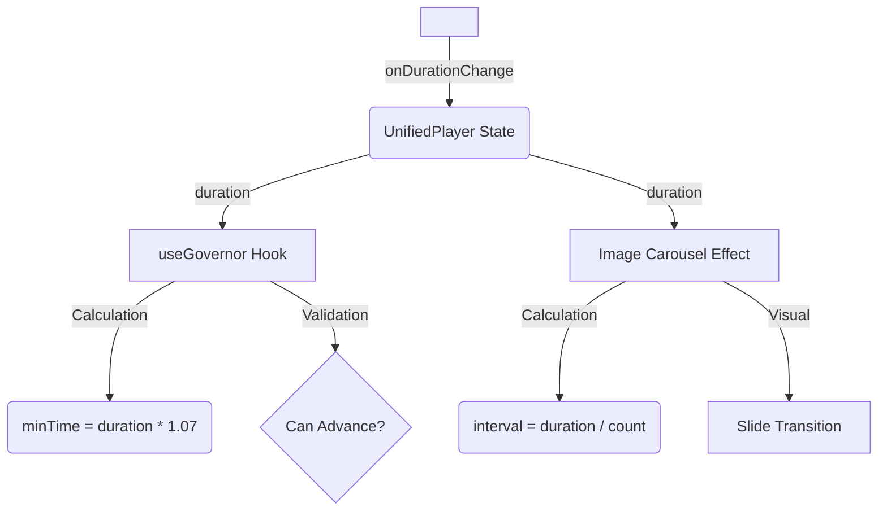

# LMS_01218_A - Architecture Documentation

## CLI Bot Instructions

This document provides explicit rules for organizing content. A CLI bot should use these rules to:
1. Create correct folder structures
2. Name files correctly
3. Generate valid manifest.json files
4. Validate content integrity

---

## Folder Structure

```
public/content/
├── hour_{N}/                      # N = 1, 2, 3, or 4
│   └── block_{XXX}/               # XXX = 001, 002, 003... (zero-padded 3 digits)
│       ├── manifest.json          # REQUIRED - metadata file
│       ├── slide_a.jpeg           # Optional - image assets
│       ├── slide_b.jpeg
│       ├── audio.wav              # Optional - narration
│       └── video.mp4              # Optional - video file
```

### Folder Creation Rules

| Rule | Pattern | Example |
|------|---------|---------|
| Hour folder | `hour_{N}` where N ∈ {1,2,3,4} | `hour_1`, `hour_2` |
| Block folder | `block_{XXX}` where XXX is 3-digit zero-padded | `block_001`, `block_012` |
| Intro block | `block_000_intro` | Special first block for hour |

### CLI Commands to Create Structure

```bash
# Create new hour folder
mkdir -p public/content/hour_1

# Create new block folder
mkdir -p public/content/hour_1/block_001

# Create block with all subdirs
mkdir -p public/content/hour_{1..4}/block_00{1..5}
```

---

## File Naming Rules

### Images

| Rule | Value |
|------|-------|
| Pattern | `slide_{letter}.jpeg` |
| Letters | Sequential: a, b, c, d, e, f... |
| Format | `.jpeg` (preferred) or `.jpg` or `.png` |
| Max per block | No limit, but typically 3-6 |

**Algorithm:**
```python
def get_image_filename(index: int) -> str:
    letter = chr(ord('a') + index)  # 0='a', 1='b', 2='c', etc.
    return f"slide_{letter}.jpeg"
```

### Audio

| Rule | Value |
|------|-------|
| Filename | `audio.wav` OR `audio.mp3` |
| Only ONE audio file per block | |

### Video

| Rule | Value |
|------|-------|
| Filename | `video.mp4` |
| Only ONE video file per block | |

### Manifest

| Rule | Value |
|------|-------|
| Filename | `manifest.json` (ALWAYS this exact name) |
| Location | Root of block folder |
| Required | YES - every block MUST have this |

---

## Block ID Generation

```python
def generate_block_id(hour: int, block_number: int) -> str:
    """
    hour: 1-4
    block_number: 1, 2, 3, ...
    returns: "block_001", "block_002", etc.
    """
    return f"block_{block_number:03d}"
```

---

## manifest.json Template

```json
{
    "block_id": "block_001",
    "hour": 1,
    "title": "REQUIRED: Block Title",
    "duration_minutes": 4,
    "tdlr_citation": "§83.100",
    "media_type": "images",
    "content": {
        "scenario": "REQUIRED: Scenario text",
        "connection": "REQUIRED: Connection text",
        "law": "REQUIRED: Law/citation text"
    },
    "assets": {
        "images": ["slide_a.jpeg", "slide_b.jpeg"],
        "audio": "audio.wav",
        "video": null
    }
}
```

### Field Validation Rules

| Field | Type | Required | Validation |
|-------|------|----------|------------|
| `block_id` | string | ✅ | Must match folder name |
| `hour` | integer | ✅ | 1 ≤ hour ≤ 4 |
| `title` | string | ✅ | Non-empty |
| `duration_minutes` | integer | ✅ | 1 ≤ duration ≤ 60 |
| `tdlr_citation` | string | ❌ | Optional |
| `media_type` | string | ✅ | One of: `"images"`, `"video"`, `"quiz"` |
| `content.scenario` | string | ✅ | Non-empty |
| `content.connection` | string | ✅ | Non-empty |
| `content.law` | string | ✅ | Non-empty |
| `assets.images` | array | ❌ | Filenames must match files in folder |
| `assets.audio` | string | ❌ | Filename or null |
| `assets.video` | string | ❌ | Filename or null |

---

## Content Organization Algorithm

```python
def organize_content_block(
    hour: int,
    block_number: int,
    title: str,
    scenario: str,
    connection: str,
    law: str,
    images: list[str] = None,     # List of source image paths
    audio: str = None,             # Source audio path
    video: str = None,             # Source video path
    youtube_url: str = None,
    tdlr_citation: str = None
):
    """
    1. Create folder structure
    2. Copy and rename assets
    3. Generate manifest.json
    """
    
    # Step 1: Create folder
    block_id = f"block_{block_number:03d}"
    folder = f"public/content/hour_{hour}/{block_id}"
    os.makedirs(folder, exist_ok=True)
    
    # Step 2: Copy and rename images
    image_filenames = []
    if images:
        for i, src_path in enumerate(images):
            letter = chr(ord('a') + i)
            dest_name = f"slide_{letter}.jpeg"
            shutil.copy(src_path, f"{folder}/{dest_name}")
            image_filenames.append(dest_name)
    
    # Step 3: Copy audio
    audio_filename = None
    if audio:
        ext = os.path.splitext(audio)[1]
        audio_filename = f"audio{ext}"
        shutil.copy(audio, f"{folder}/{audio_filename}")
    
    # Step 4: Copy video
    video_filename = None
    if video:
        video_filename = "video.mp4"
        shutil.copy(video, f"{folder}/{video_filename}")
    
    # Step 5: Determine media type
    if video or youtube_url:
        media_type = "video"
    elif len(image_filenames) > 0:
        media_type = "images"
    else:
        media_type = "quiz"
    
    # Step 6: Generate manifest
    manifest = {
        "block_id": block_id,
        "hour": hour,
        "title": title,
        "duration_minutes": 4,
        "tdlr_citation": tdlr_citation,
        "media_type": media_type,
        "content": {
            "scenario": scenario,
            "connection": connection,
            "law": law
        },
        "assets": {
            "images": image_filenames if image_filenames else None,
            "audio": audio_filename,
            "video": video_filename,
            "youtube_url": youtube_url
        }
    }
    
    with open(f"{folder}/manifest.json", "w") as f:
        json.dump(manifest, f, indent=4)
    
    return folder
```

---

## Validation Algorithm

```python
def validate_block(folder_path: str) -> list[str]:
    """Returns list of validation errors. Empty list = valid."""
    errors = []
    
    # Check manifest exists
    manifest_path = f"{folder_path}/manifest.json"
    if not os.path.exists(manifest_path):
        errors.append("Missing manifest.json")
        return errors
    
    # Load and validate manifest
    with open(manifest_path) as f:
        manifest = json.load(f)
    
    # Required fields
    required = ["block_id", "hour", "title", "media_type", "content"]
    for field in required:
        if field not in manifest:
            errors.append(f"Missing required field: {field}")
    
    # Validate block_id matches folder
    folder_name = os.path.basename(folder_path)
    if manifest.get("block_id") != folder_name:
        errors.append(f"block_id '{manifest.get('block_id')}' doesn't match folder '{folder_name}'")
    
    # Validate hour range
    if not (1 <= manifest.get("hour", 0) <= 4):
        errors.append("hour must be 1-4")
    
    # Validate images exist
    if manifest.get("assets", {}).get("images"):
        for img in manifest["assets"]["images"]:
            if not os.path.exists(f"{folder_path}/{img}"):
                errors.append(f"Missing image file: {img}")
    
    # Validate audio exists
    if manifest.get("assets", {}).get("audio"):
        audio = manifest["assets"]["audio"]
        if not os.path.exists(f"{folder_path}/{audio}"):
            errors.append(f"Missing audio file: {audio}")
    
    return errors
```

---

## Update HOUR_BLOCKS in useBlock.js

When adding new blocks, update `src/hooks/useBlock.js`:

```javascript
export const HOUR_BLOCKS = {
    1: ['block_001', 'block_002', 'block_003', 'block_004', 'block_005'],
    2: ['block_000_intro', 'block_001', 'block_002'],
    3: ['block_001'],
    4: ['block_001']
};
```

---

## Quick Reference Commands

```bash
# List all blocks for an hour
ls public/content/hour_1/

# Validate all manifests exist
find public/content -name "manifest.json" | wc -l

# Find blocks missing manifest
for d in public/content/hour_*/block_*; do
  [ ! -f "$d/manifest.json" ] && echo "Missing: $d"
done

# Count images per block
for d in public/content/hour_*/block_*; do
  echo "$d: $(ls $d/*.jpeg 2>/dev/null | wc -l) images"
done
```

---

## Last Updated
2025-12-17T16:23:00

---

## Player Architecture & Timing Logic

### Core Principles
The Player is designed to be **Audio-Driven**. The audio file is the source of truth for all timing.

### 1. The Trinity of Time
There are three distinct time concepts in the player:

1.  **Raw Audio Time (audioDuration)**: The actual length of the MP3/WAV file.
2.  **Governor Time (minTime)**: The mandatory "compliance" time.
    *   **Rule:** minTime = audioDuration + 7% Buffer
    *   *Purpose:* Account for reading time after audio ends.
3.  **Visual Time (carouselInterval)**: How long each image stays on screen.
    *   **Rule:** carouselInterval = audioDuration / imageCount
    *   *Purpose:* Ensure all images are shown evenly *during* the audio playback.

### 2. Data Flow


### 3. Component Responsibility
*   **UnifiedPlayer.jsx**: Orchestrator. Holds the `audioDuration` state to ensure synchronization.
*   **useGovernor.js**: Logic Engine. Calculates the 7% buffer and tracks "Time Remaining".
*   **useDevMode.js**: Override. Provides `devModeEnabled` to bypass Can Advance? checks.

### 4. Image Carousel Behavior
*   **Always On**: Runs automatically for all image blocks.
*   **Proportional**: Adapts to audio length.
*   **No Loop**: Stops at the last image to prevent jarring restarts during the 7% buffer silence.
*   **Fallback**: If no audio exists, defaults to 8 seconds per image.

### 5. Dev Mode
*   **Toggle**: `Ctrl + Shift + D` or Click the ⚡ Zap icon.
*   **Effect**: Ignores `timeRemaining` and enables the Next button immediately.

---
